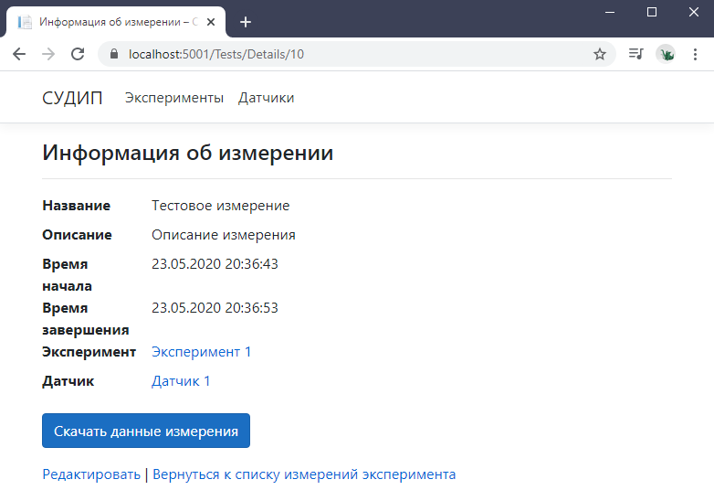
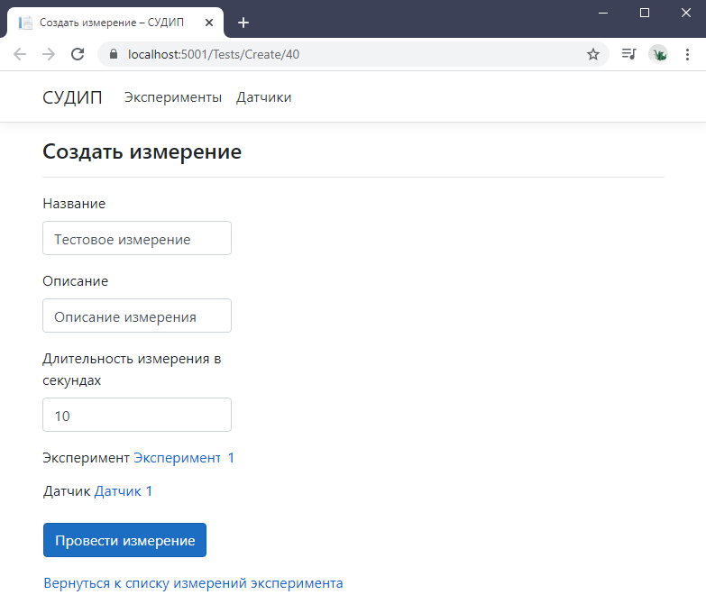

# ПОЯСНИТЕЛЬНАЯ ЗАПИСКА – README/README.pdf

# Выпускная квалификационная работа

# Разработка веб-интерфейса для системы управления данными исследовательских проектов

Объектом исследования являются исследовательские проекты.

Цель работы – разработать веб-интерфейс для системы управления данными исследовательских проектов.
В процессе работы были разработаны алгоритмы и соответствующая программа, позволяющая пользователю создавать эксперименты, проводить измерения в рамках экспериментов, а также обрабатывать экспериментальные данные. Система позволяет пользователю управлять данными исследовательского проекта.

Система разработана на языке C# 8.0 с использованием фреймворка ASP.NET Core 3.1 и функционирует под управлением операционных систем Ubuntu 18.04 и Windows 10. Доступ к данным осуществляется с помощью СУБД PostgreSQL 12.2.
